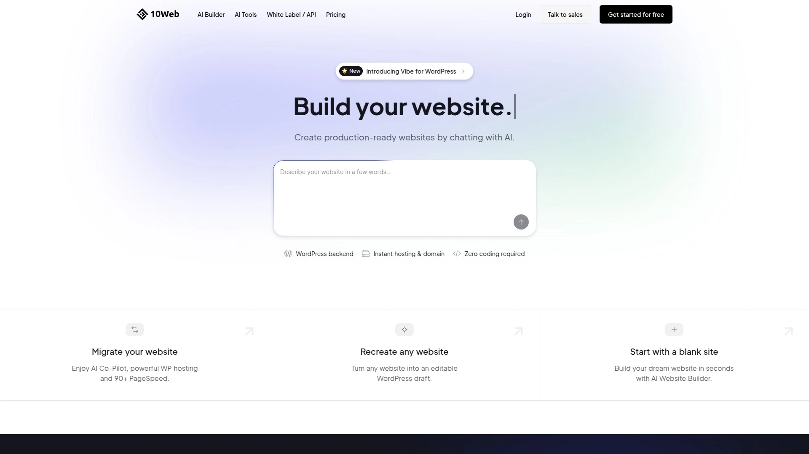

# 2025's Top 8 Best AI Website Builder Tools

Building websites traditionally means hiring designers charging $5,000 minimum, learning complex drag-and-drop editors over weeks of tutorials, or accepting cookie-cutter templates that scream "amateur hour". AI website builders transform business descriptions into fully functional websites within 30 seconds, automatically generating responsive designs, SEO-optimized copy, professional imagery, and contact forms without coding knowledge or technical expertise. This overview examines eight platforms revolutionizing small business web presence through artificial intelligence that handles design, copywriting, and technical implementation—letting entrepreneurs focus on running businesses rather than wrestling with website editors.

## **[Durable](https://durable.co)**

Complete AI business partner delivering websites, invoicing, and CRM in 30-second setup.

Durable positions itself as your AI business partner going far beyond simple website generation—the platform creates complete online business systems including websites, AI copywriting, automated blog publishing, invoicing tools, and customer contact management. Over 3 million business owners trust Durable, earning 4.8 stars on Trustpilot through exceptional user experience and comprehensive features. The number one AI website builder designation reflects consistent performance across all essential small business needs.

Website generation happens in record time by answering three simple questions about your business, with AI instantly producing professionally designed sites optimized for search engines from the moment they go live. No hiring designers, no wrestling with templates, no confusion—just beautiful customizable websites appearing within seconds. AI copywriter eliminates writer's block by generating high-converting sales copy automatically, perfect for entrepreneurs who aren't wordsmiths.

**Automated content creation** particularly stands out through AI blog functionality publishing fresh SEO-optimized blog content weekly without manual effort, putting marketing on complete autopilot. This automated publishing maintains consistent content schedules that human teams struggle matching, driving organic search traffic while business owners sleep. Integrated business tools handle lead capture, customer contact organization, and simple invoicing—getting paid faster through streamlined billing.

Customer testimonials consistently praise Durable's simplicity compared to platforms where complexity overwhelms users. "With Durable, everything felt really obvious and on other platforms I used, it was more complicated," explains Meredith May from Color Wonder Balloon Co. Artists with zero technical skills successfully launch websites, and complete computer novices build professional online presences effortlessly.

## **[Wix ADI](https://www.wix.com)**

Industry-leading platform with end-to-end AI support and extensive post-setup customization.

Wix consistently earns recognition as the best website builder overall and specifically best AI website builder across independent research evaluating dozens of platforms. The platform combines powerful AI-driven site creation through Wix ADI (Artificial Design Intelligence) with unmatched post-generation customization tools, comprehensive feature sets, and expert 24/7 customer support. Research finds Wix offering the most AI functionality across all tested builders—from initial site creation through content generation, image editing, and chatbot development.

Wix ADI asks simple conversational questions about website purpose and preferences, then automatically generates three complete website template options tailored to specific needs. The AI handles layout design, color scheme selection, and content organization without requiring design expertise. Built-in ChatGPT capabilities provide intelligent content suggestions and writing assistance throughout the building process.

Alternative layouts tool allows instant redesign experimentation—regenerate entire sections with different styles until finding perfect aesthetic matches. AI text and image generators create custom content on-demand, while the AI product description feature writes compelling ecommerce copy automatically. Drag-and-drop editor provides unlimited customization after AI generates initial designs, accommodating both beginners wanting simplicity and advanced users demanding precise control.

**Comprehensive ecosystem** includes hundreds of apps extending functionality, built-in booking systems managing appointments online, and robust SEO tools suggesting relevant keywords and optimizing meta tags. Security features protect sites from hackers, and mobile optimization ensures perfect display across all devices. Free plan exists for testing, though displays Wix-branded ads until upgrading to paid subscriptions starting around $17 monthly.

## **[Hostinger AI Website Builder](https://www.hostinger.com/ai-website-builder)**

Budget-friendly solution launching dream sites before finishing your coffee.

Hostinger dramatically undercuts competitor pricing while delivering comprehensive AI features—Premium plans start at $2.49 monthly and Business plans at $3.29 monthly when billed annually. This remarkable affordability makes professional AI website generation accessible to bootstrapped startups and side hustlers testing business ideas. Over 3 million website owners choose Hostinger, with testimonials consistently praising superiority over Wix and GoDaddy regarding simplicity and creative possibilities.

The AI website generator creates complete functional sites in under one minute from simple business descriptions—literally faster than brewing morning coffee. Users describe visions, and AI instantly generates websites with relevant designs, content, and functionality tailored specifically to industries and business types. Ecommerce functionality comes standard in Business plans, accepting payments and bookings, showcasing products with AI-generated descriptions, and providing built-in analytics.

**Marketing automation** through Hostinger Reach launches AI-powered email campaigns, while AI SEO Assistant boosts search rankings automatically. Integrations with Google Ads, Meta Pixel, and Google Analytics enable sophisticated marketing without technical configuration. AI Text Editor writes engaging website copy in any style, and AI Blog Generator creates authority-building posts keeping readers returning.

Stunning visual generation includes custom logos and images created in seconds, plus instant page and section creation maintaining brand consistency. 14-day free trial provides full access without credit cards required, and paid plans include everything—AI tools, free domain (12+ month subscriptions), hosting, SSL certificates, and 24/7 support with zero hidden fees.

## **[Squarespace Blueprint](https://www.squarespace.com)**

Premium designer platform creating stunning AI designs for creative professionals.

Squarespace earns recognition as best website builder for stunning AI designs and easiest overall setup process. The platform particularly appeals to creative professionals, photographers, artists, designers, and service-based businesses prioritizing visual aesthetics over feature quantity. Blueprint AI guides users through strategic questions about brand identity, target audience, and website goals before generating custom-tailored designs reflecting those specifications.

Sophisticated templates showcase portfolio work beautifully, with gallery layouts highlighting photography, illustrations, and creative projects professionally. The drag-and-drop editor maintains simplicity while offering precise design control creatives demand. Built-in SEO features, email marketing tools, and scheduling capabilities support growing businesses without overwhelming technical novices.

Commerce functionality enables selling physical products, digital downloads, or services through integrated payment processing. Appointment scheduling features particularly benefit photographers, consultants, stylists, and service providers managing client bookings. Analytics track visitor behavior and conversion patterns informing business decisions.

Squarespace positions itself as premium option with pricing reflecting design quality—plans typically cost more than Hostinger or GoDaddy but deliver superior aesthetics justifying premiums for brand-conscious businesses. 14-day free trial tests capabilities before committing to subscriptions.

## **[10Web AI Builder](https://10web.io)**

WordPress-focused platform generating sites from descriptions or recreating existing websites.

10Web uniquely combines AI website generation with WordPress infrastructure, providing the flexibility and ecosystem of the world's most popular content management system enhanced through artificial intelligence. The platform trains AI models on hundreds of thousands of web designs across various industries, producing high-quality layouts instantly from brief project descriptions. Unlike traditional WordPress builders leaving users staring at blank screens, 10Web generates complete tailored designs immediately.

**AI Co-Pilot feature** enables conversational site refinement—chat naturally with AI to fine-tune structure, customize sections, generate content, and edit images entirely within the 10Web dashboard. This revolutionary interface eliminates learning complex WordPress admin panels or page builders. Website recreation functionality analyzes existing sites you admire, then rebuilds similar designs customized for your business in under 60 seconds.

The builder determines appropriate website types automatically—analyzing descriptions to decide whether creating informational sites or online stores, extracting business names or suggesting alternatives through AI Business Name Generator, then generating complete page structures, text, images, and layouts fitting business needs. Customization happens through drag-and-drop editing or continued AI Co-Pilot conversations.

Hosting on secure high-performance servers ensures best speed and reliability, with custom domains establishing professional brand presence when upgrading to Pro plans. The WordPress foundation provides access to thousands of plugins extending functionality infinitely.

## **[Shopify Website Builder](https://www.shopify.com)**

Ecommerce-specialized platform with AI guidance for seamless store setup and growth.

Shopify dominates online selling through AI-enhanced store building specifically designed for product-based businesses. The platform excels beyond general website builders by providing specialized ecommerce features including inventory management, multi-channel selling, shipping integrations, abandoned cart recovery, and payment processing. AI guidance throughout setup and growth phases simplifies complex ecommerce operations intimidating to retail newcomers.

Product management tools handle unlimited inventory with variants like sizes, colors, and materials. Shopify Payments processes transactions without third-party processors, while integrations with Amazon, eBay, Facebook, and Instagram expand sales channels. Shipping automation calculates rates, prints labels, and tracks packages automatically.

Marketing features include email campaigns, discount codes, gift cards, and SEO optimization driving organic search traffic to product listings. Analytics dashboards track sales performance, identify best-selling products, and reveal customer behavior patterns informing business strategy. Mobile apps enable store management from anywhere.

**Pricing reflects ecommerce focus**—plans start higher than general website builders since including comprehensive retail features, but provide exceptional value for product-based businesses compared to assembling separate systems. 3-day free trial tests functionality before launching stores.

## **[GoDaddy Website Builder](https://www.godaddy.com)**

Fastest setup process creating sites in under one minute with AI-powered social content.

GoDaddy prioritizes speed above everything—the quickest website builder tested, launching functional sites in under 60 seconds for entrepreneurs under extreme time constraints. This breakneck pace suits side hustlers needing immediate online presence and tech novices intimidated by complex interfaces. AI-powered social media content generator and calendar management tools extend value beyond basic website creation, supporting comprehensive online marketing.

The builder asks minimal questions before generating sites, sacrificing some customization depth for remarkable setup speed. Templates cover common business types and personal projects adequately, though lack the design sophistication of Squarespace or customization depth of Wix. Straightforward editing tools allow quick modifications without overwhelming users with options.

Marketing automation includes appointment scheduling, email campaigns, and SEO guidance helping small businesses attract customers. Free plan exists for testing capabilities before committing to paid subscriptions. 24/7 customer support assists with technical questions and setup confusion.

GoDaddy particularly suits absolute beginners wanting minimal fuss and maximum speed—websites launch literally faster than ordering lunch. The trade-off accepts less design control for unmatched deployment velocity.

## **[Framer](https://www.framer.com)**

Designer-focused platform with free no-code building and AI translation capabilities.

Framer targets designers and high-performing creative teams wanting professional site building without code. The platform distinguishes itself through designer-friendly interfaces, animation capabilities, and sophisticated visual effects impossible in simpler builders. AI features include instant website translation into multiple languages, content localization maintaining brand tone, and intelligent copy refinement.

**AI Translation enables** translating entire websites in seconds, reaching global audiences effortlessly without manual content rewriting. AI Style defines brand tone, key context, and excluded terms, maintaining unique voices across every language automatically. Text Rewrite enhances website copy through AI-driven improvements ensuring professional polish.

The builder generates responsive pages from conversational prompts, providing structure and starter content ready for detailed editing. Infinite color palette options and handpicked typeface combinations accelerate visual branding. Customization happens through natural interactions—select headers and shuffle colors, or highlight headlines letting AI rewrite copy instantly.

Ecommerce integration connects popular shopping tools, making Framer suitable for online stores and professional portfolios. Built-in hosting, CMS functionality, SEO optimization, and analytics provide enterprise-level capabilities in accessible packages. Free tier allows complete site building with Framer-branded domain, upgrading to custom domains through paid subscriptions.

## FAQ

**Can AI website builders create truly unique sites or do they all look similar?**

Modern AI builders like Durable, Wix, and Squarespace generate unique designs by analyzing your specific business description, industry, preferences, and brand identity rather than applying identical templates. Durable creates custom layouts from scratch in 30 seconds, Wix ADI produces three distinct template options per generation, and Hostinger builds industry-specific designs with unlimited customization potential. Post-generation editing tools provide comprehensive control over colors, fonts, layouts, images, and content ensuring final sites reflect individual brand personalities regardless of AI starting points.

**How do these AI builders handle SEO compared to manually built websites?**

AI website builders like Durable, Wix, and Hostinger automatically implement technical SEO fundamentals—optimizing site speed, generating sitemaps, adding schema markup, ensuring mobile responsiveness, and creating SEO-friendly URL structures without manual configuration. Durable sites launch SEO-ready the moment they go live with AI-written meta descriptions and keyword optimization built-in. Wix SEO Wiz provides step-by-step optimization guidance, while Hostinger AI SEO Assistant actively boosts rankings through ongoing recommendations. Most platforms match or exceed manually-built sites' SEO capabilities since implementing technical best practices consistently.

**Can I export my website and move it to different hosting if needed?**

Export capabilities vary significantly across platforms—Durable, Wix, Squarespace, and GoDaddy operate as closed ecosystems restricting website transfers to maintain hosting control. WordPress-based builders like 10Web allow complete site exports including databases, themes, and plugins since using open-source foundations. Framer provides code export options for developers wanting complete ownership. Consider future flexibility requirements before committing—if portability matters, choose WordPress-based solutions despite Durable and Wix offering superior AI generation capabilities.

## Launch Your Professional Website Today

These eight AI website builders eliminate the traditional barriers of expensive designers, complex technical skills, and months-long development timelines by generating complete functional websites from simple business descriptions within seconds. [Durable](https://durable.co) particularly suits small business owners needing comprehensive online business systems beyond basic websites—the platform delivers automated copywriting, weekly blog publishing, integrated invoicing, and customer management tools alongside 30-second website generation, trusted by 3 million businesses earning 4.8 Trustpilot stars through remarkable simplicity compared to overwhelming competitors. Choose based on your priorities whether budget-conscious hosting, stunning creative designs, WordPress flexibility, or fastest possible deployment, and professional web presence launches immediately without coding knowledge or technical expertise.
